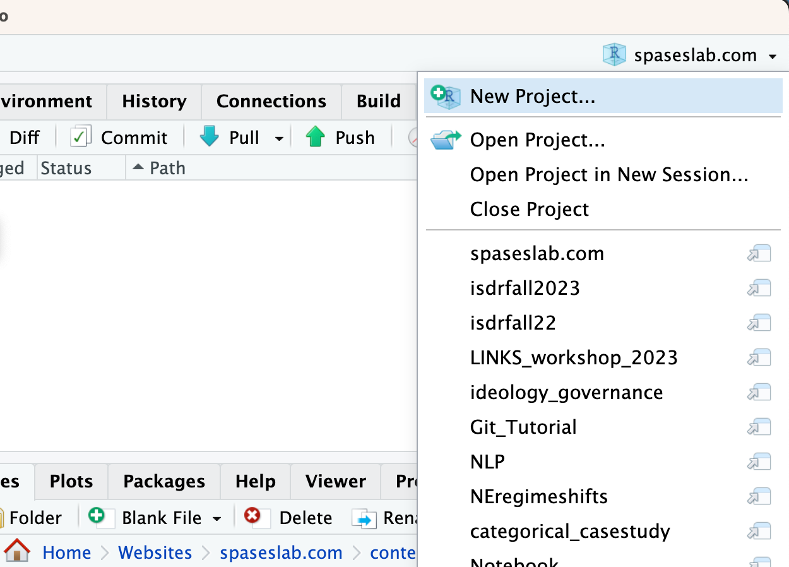
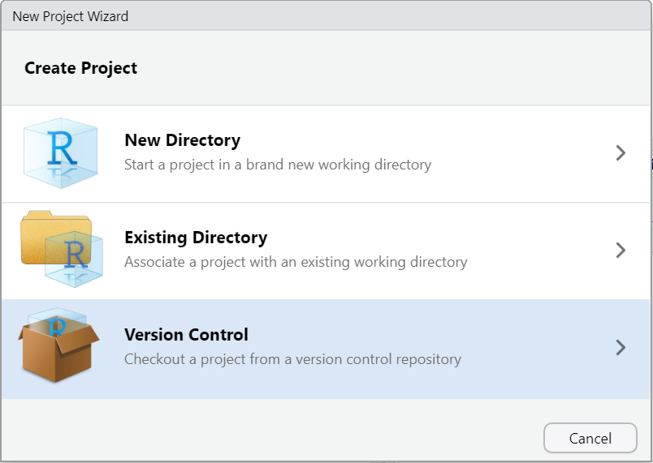
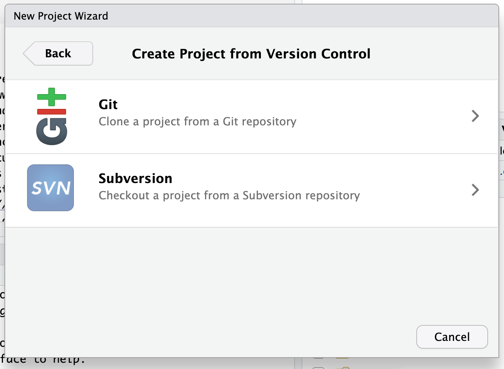
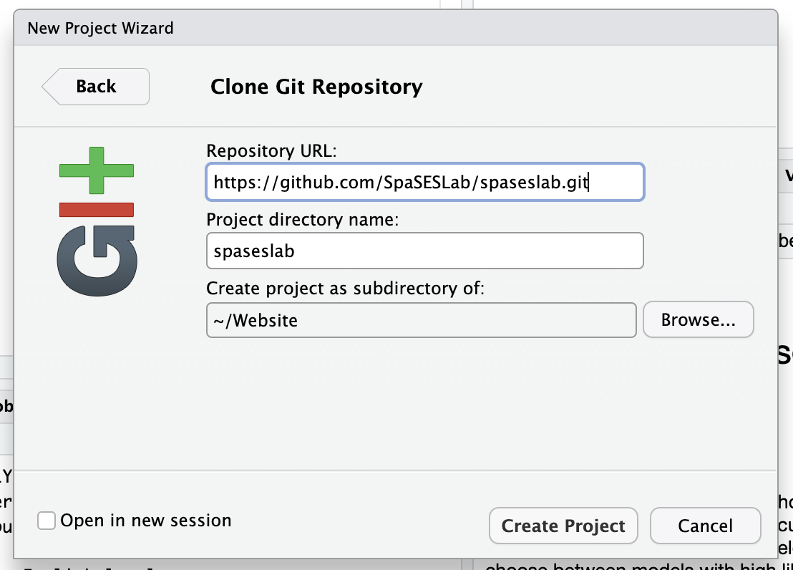
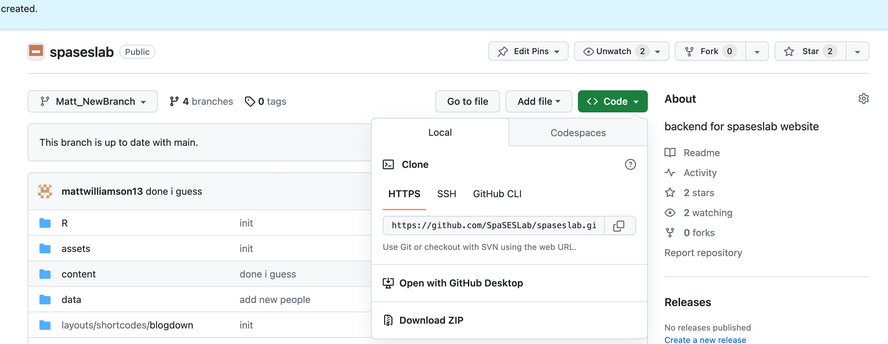
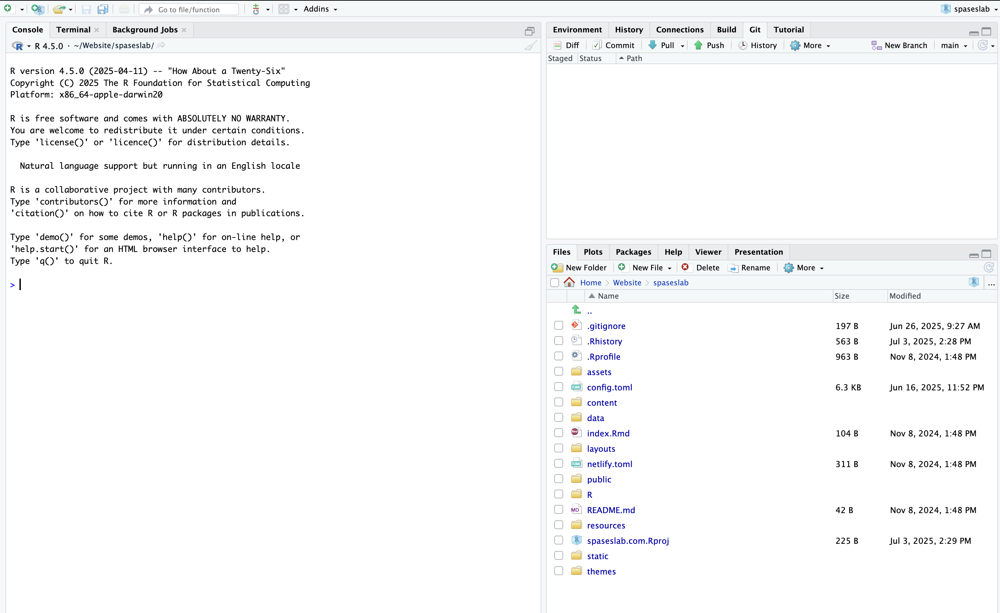

## Objectives 
1. Successfully clone a repository into your RStudio Session
2. Edit a Quarto document, save the changes, and commit them to git
3. Render a Quarto document into a final html page

## Gitting started

### Cloning a repository to RStudio

Each assignment in Github Classroom creates a repository for you in your Github account. To work on it; however, you'll have to get it into Rstudio. I'll show you how to do that now.

Start by creating a new project. Click on the little cube in the top right of RStudio, it should give you a dropdown that looks like this:

Click on the New project button it should bring up a window that looks like:

Click on the version control option which will bring up

Select the Git option which will open:

Now go back to the assignment page in GitHub and click the Code dropdown button (green in the topright)

Copy the link that appears under the HTTPS option and pasted it in the repository URL in the RStudio Git interface.

Now you should be able to click “Create Project” and clone the assignment into your RStudio server session.  If you were successful, your RStudio screen should look something like this:

You’ll see a “Git” tab in the same pane as your “Environment” pane, you’ll see all of the files and folders associated with the webpage in the “Files” pane, you’ll see the project name in the top right corner next to the R box, and you see the branch you’re working on in the “Git” tab of your environment pane.

Now that you've successfully linked RStudio to the repository (and pulled all of the current files). It's time to start working on a document!

## The git workflow

* Make sure to **pull** everytime you start working on a project

* Make some changes to code

* Save those changes

* Commit your changes

* Push your work to the remote!

