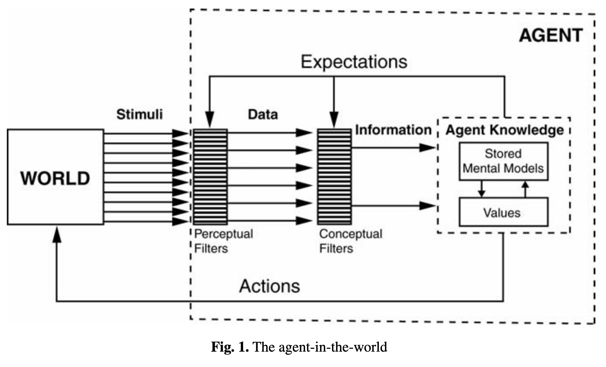

## Today's Plan {background="#9F281A" background-image="img/slide_1/Helix_Nebula.jpeg"}

:::{style="font-size: 1.2em; text-align: middle; margin-top: 2em"}
- Data, information, and knowledge

- The elements of data quality

- Concerns with the growth in available data

- Towards data justice

:::

##

  <figure>
  
  <figcaption style="font-size: 0.6em; margin-top: -1em"><a href="https://link.springer.com/article/10.1007/s00191-003-0181-9">Boisot and Canals, 2004</a></figcaption>
  </figure>

