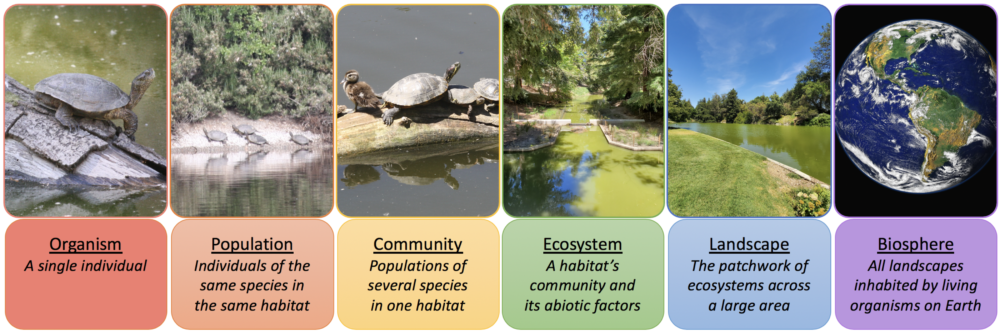
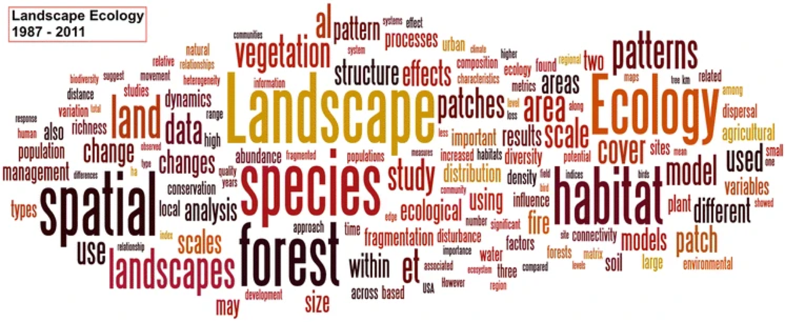
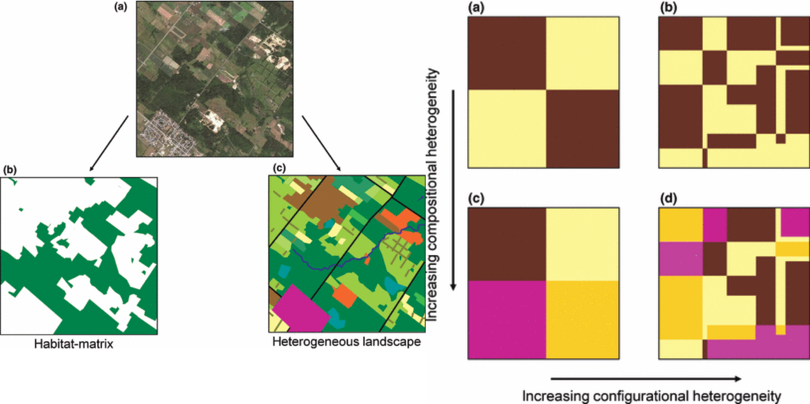
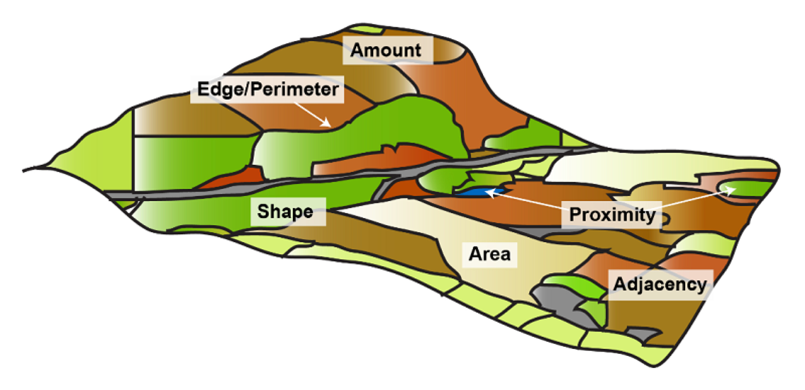
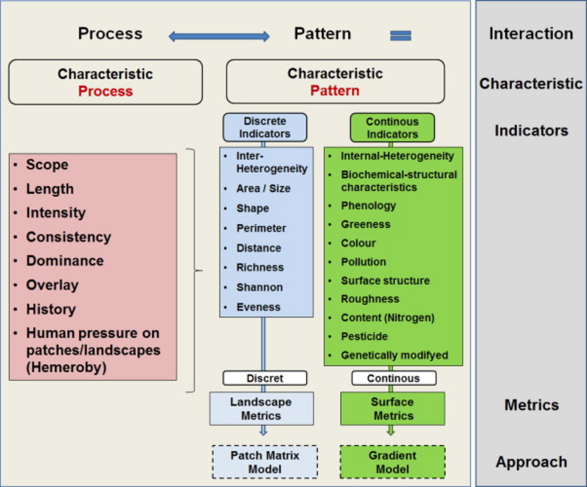
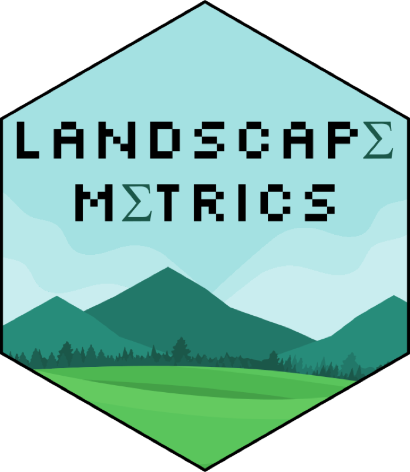

## Objectives

* **Describe** the importance of measuring recurrent landscape patterns

* **Distinguish** between patch, class, and landscape-level metrics

* **Implement** patch metric calculations using the `landscapemetrics` package for `R`

# What do we mean by landscape?

## Definining landscapes

## Defining Landscapes

## Core Concepts

* Heterogeneity is a defining feature of a landscape

* Landscapes can be defined and studied at any scale

* Patterns and processes occur across scales

* Not limited to terrestrial systems

## Heterogeneity and Dynamics

::: columns
::: {.column width="60%"}

:::
::: {.column width="40%"}
* Composition

* Matrix vs. patch-mosaic vs. gradients

* Community composition

* Turnover and invasion

:::
:::

## Measuring Patches

## Measuring Patches

::: columns
::: {.column width="60%"}

:::
::: {.column width="40%"}

:::
:::

## Measuring Patches

* **Patch** metrics: describe attributes of each patch

* **Class** metrics: describe the distribution of patches within each category

* **Landscape** metrics: describe the composition of the landscape based on patches and categories

> Scale Matters!!!

## Most Metrics Are Correlated

* Combinations are possible (PCA - Wednesday)

* **Strength** - The average variance in configuration explained by a metric/combination

* **Consistency** - Do the metrics/combinations mean the same thing in different patches/landscapes

* **Universality** - The percentage of regions where the metric/combination plays a role

## Why Do We Care

* Describe the landscape mosaic

* As a foundation for varying rates in point process models

* As predictors for other models

* As an objective for planning