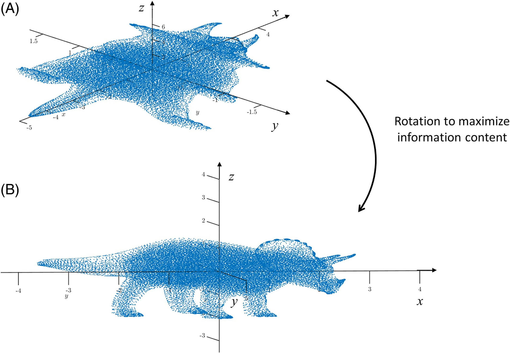
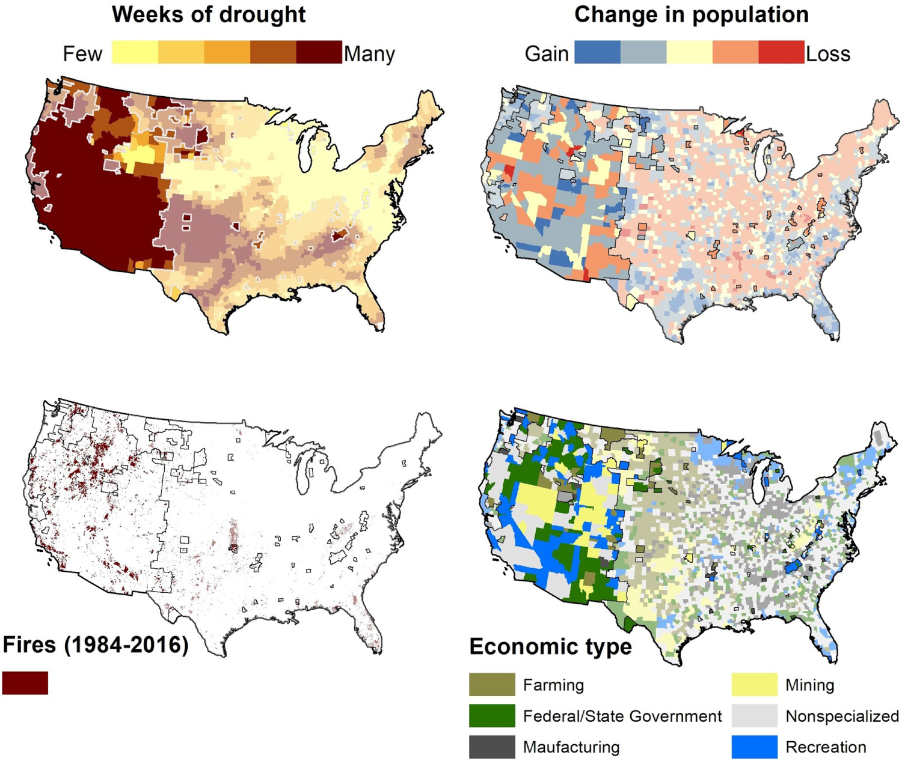
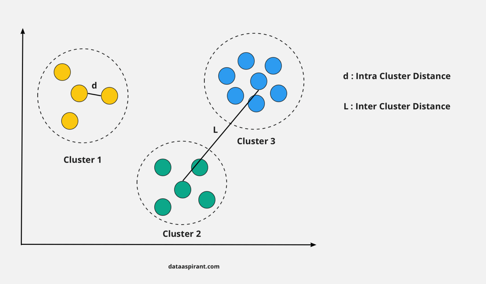

## Objectives

- **Describe** the motivations for dimension reduction with spatial data

- **Distinguish** the differences between PCA and cluster analysis

- **Understand** common metrics for assessing the quality of dimension reduction results 

- **Implement** simple PCA and cluster analysis using `R` 

## What is Dimension Reduction

* Reducing the number of variables without losing important information!!

* Generalizeable (not just for spatial data)

## Why Dimension Reduction

* Dealing with (multiple) correlations

* Identifying latent structures in the data

* Parsimony in statistical models

# Identifying Gradients with PCA

## What is PCA?

* Dimension reduction without info loss

* Comonents are "new" composed of "parts" of variables

* Variables "load" onto components

* Components are defined to be _orthogonal_

## How does PCA work?
::: columns
::: {.column width="40%"}

* Creates new "coordinate systems" that maximizes variance on that axis

* "Rotation matrix" maps original variables onto new axes

:::
::: {.column width="60%"}

:::
:::

## How can we tell how well PCA worked?

* Variance Explained per component

* Cumulative variance explained (scree plots)

# Unsupervised Classification with Cluster Analysis

## Unsupervised Classification

::: columns
::: {.column width="40%"}

* No "outcome" variable

* Consistent "patterns" in the data = clusters

* Reduces (a lot of) information into categorical classes

::: 
::: {.column width="60%"}

:::
:::
## How Does Cluster Analysis work?

* Data in multivariate space

* Cluster centers assigned to minimize distance to observations and maximize distance between centers

* Variaton in how centroids are assigned and stopping rules

## Evaluating the Quality of Our Clusters

::: columns
::: {.column width="40%"}

* Explained inertia - _within_ cluster variation (0:1, lower = better)

* Silhouette index - overall structure of the data (-1:1, higher = better)

:::
::: {.column width="40%"}

:::
:::

# Final Thoughts

## Things to Consider

* Spatial autocorrelation

* Newer Algorithms

* What is your Goal?