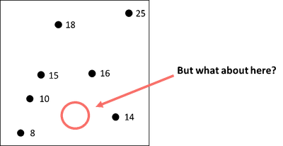
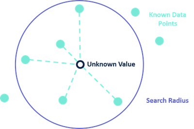
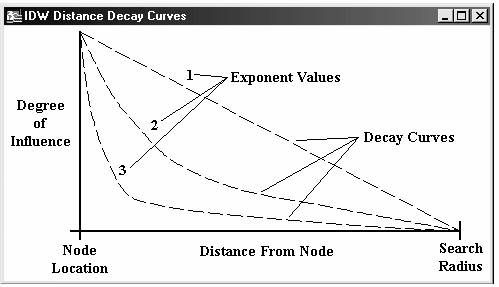
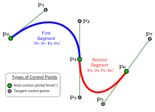
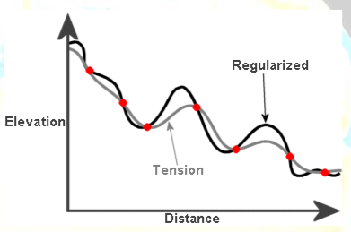

## Objectives

*   **Describe** reasons for interpolating data

*   **Distinguish** between deterministic and probabilistic methods for interpolation

*   **Characterize** the difference between distance- and spline-based interpolation

*   **Implement** two common interpolation methods in `R`

# 
:::{style="font-size: 1.4em; text-align: middle; margin-top: 2em"}
How do you view the world?
:::

## ...As a Continuous Field

```{=html}
<style>
.semi-transparent {
  opacity: 0.5;
}
</style>
```

::: columns
::: {.column width="50%"}
:::{style="font-size: 0.8em;"}
- The earth is a single entity with properties that vary continuously through space

- **Spatial continuity: Every cell has a value (including "no data" or "not here")**

- Self-definition: the values define the field{.semi-transparent} 

- Space is tessellated: cells are mutually exclusive
:::
:::

::: {.column width="50%"}

:::
:::

# ...but what about missing data?

## {background="#D3D3D3"}

::: columns
::: {.column width="50%"}

:::

::: {.column width="50%"}

 

:::
:::

## Spatial data as a stochastic process


:::{style="font-size: 1.4em; text-align: middle; margin-top: 2.5em"}

$$
{Z(\mathbf{s}): \mathbf{s} \in D \subset \mathbb{R}^d}
$$
:::


## Interpolation

* Goal: estimate the value of $Z$ at new points in $\mathbf{D}$

* Deterministic: Surfaces created directly from measured points

* Probabilistic: Relies on statistical properties of measured points

## Inverse-Distance Weighting {background="#D3D3D3"}

::: columns
::: {.column width="50%"}


:::
::: {.column width="50%}
* Unknown point estimated as weighted average

* Weight based on distance (Tobler)

* Can include all points or a subset

:::
:::

## Inverse-Distance Weighting

$$
\begin{equation}
\hat{z}(\mathbf{x}) = \frac{\sum_{i=1}w_iz_i}{\sum_{i=1}w_i}
\end{equation}
$$
where

$$
\begin{equation}
w_i = | \mathbf{x} - \mathbf{x}_i |^{-\alpha}
\end{equation}
$$
$\alpha$ is known as the _power_ and controls the weight.

## Thinking about Power

::: columns
::: {.column width="60%"}

:::
:::{.column width="40%"}

* Decay = negative exponent (1=linear, 2=quadratic, etc)

* Larger values = more localized results

* Lower values = more smoothed (averaged) results

:::
:::

## IDW and you

* Assumes linear relationship between distance and the unknown value

* Bounded estimation - can't predict values it's never seen

* Interpolated values are local-ish averages

* Particularly useful for dense, equally distributed data


## Splines

:::columns
:::{.column width="40%"}


:::
:::{.column width="60%"}

* A mathematical function for a curve that passes near/through points

* Piecewise polynomials that are smoothed between endpoints

* Allows for nonlinearity in relationships between distance and unknown values

:::
:::

## Splines, so many

* Tension Spline: flatter, forces estimated values to stay closer to control points

* Regularized Spline: more elastic, more likely to produce values above and below the control points

* Thin-plate Spline: a bit of middle-ground between the two.

## Splines, so many




## Splines and You

* Great when you know you've undersampled the extreme data points

* Smooth, continuous surface is the goal

* Bad when close points have very different values


