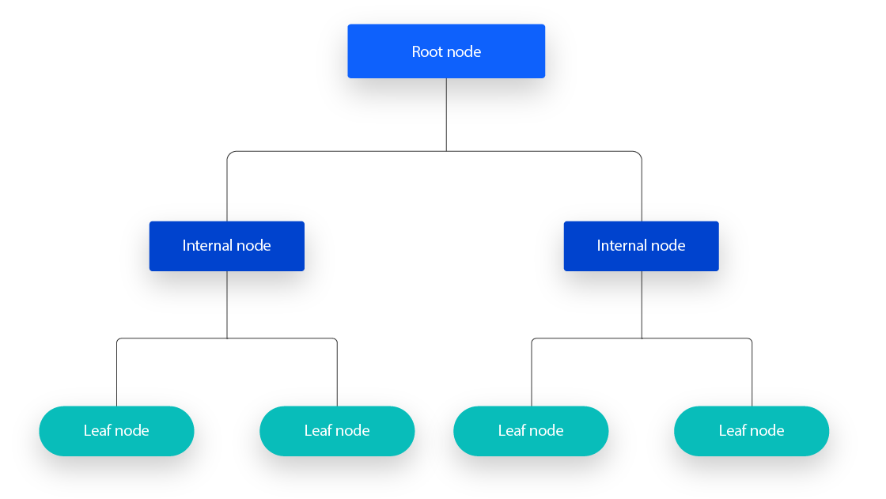
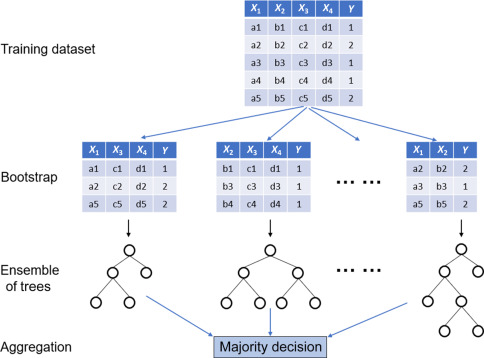

## Updates

* Grading complete by end of week

* NO CLASS WEDS 5 Nov

* Final project descriptions!!

# Statistical Learning

## Objectives

- **Differentiate** supervised from unsupervised classification

- **Recognize** the linkage between statistical learning models and interpolation

- **Define** the key elements of tree-based classifiers

- **Articulate** the differences in statistical learning for spatial data


## 

```{r}
#| echo: false
#| message: false
#| crop: true
#| fig-align: center

library(ggplot2)
D <- list("Description" = c(2, 3, 1), "Explanation" = c(4, 7, 1), "Prediction" = c(7, 5))

p <- ggvenn::ggvenn(D, c("Description", "Explanation", "Prediction"),
  show_percentage = FALSE,
  show_elements = FALSE,
  fill_color = c("#dfbbc8", "#ffc680", "#db8872"),
  fill_alpha = 0.7,
  set_name_color = "white",
  text_size = 0.0001,
  show_outside = "none"
)

p2 <- p + theme(
  panel.border = element_rect(color = "#440065", fill = "transparent"),
  panel.background = element_rect(fill = "#440065", color = "#440065"),
  plot.background = element_rect(fill = "#440065"),
  panel.grid.major = element_blank(),
  panel.grid.minor = element_blank()
)
# ggsave("venn.png", p2, bg="transparent", width=6, units = "in")
p2
```

## Explaining Spatial Patterns

:::{style="font-size: 0.85em; text-align: left; margin-top: -0.5em; margin-bottom: -0.8em;"}
- **Cognitive Description**: collection ordering and classification of data

- **Cause and Effect**: design-based or model-based testing of the factors that give rise to geographic distributions

- **Systems Analysis**: describes the entire complex set of interactions that structure an activity
:::

<div style="display: flex; justify-content: center; margin-top: -0.9em">
  
</div>

## Explanation So Far

- **Deterministic Interpolation:** best explanation for variation is distance

- **Probabilistic Interpolation:** best explanation is covariance (plus spatial trends)


## First Order Properties

$$
\begin{equation}
z(\mathbf{x}) = \mu(\mathbf{x}) + \epsilon(\mathbf{x})
\end{equation}
$$

* Often we actually care about the "drivers" of $\mu(x)$

* Inference not prediction

## Key Challenges

* Data volume

* Sampling designs

* Nonlinearity

* Autocorrelation

## Statistical Learning

* "Machine Learning"

* Broad class of methods that rely on efficient, algorithmic learning

* Probabilities derived from "large" data (rather than theoretical distributions)

* Relax traditional statistical assumptions

## Supervised Learning/Classification

* Goal is inference/prediction not grouping

* _Training_ data: observations with known values used to generate model parameters

* _Validation_ data: observations with known values used to tune hyperparameters prior to full model implementation

* _Testing_ data: observations held out of initial model-fitting to determine accuracy


## Classification Trees

::: columns
::: {.column width="30%"}
:::{style="font-size: 0.8em;"}
* Use decision rules to segment the predictor space

* Series of consecutive decision rules form a 'tree'

* Terminal nodes (leaves) are the outcome; internal nodes (branches) the splits

:::
:::
::: {.column width="70%"}


:::
:::

## Classification Trees

* Divide the predictor space ($R$) into $J$ non-overlapping regions

* Every observation in $R_j$ gets the same prediction

* _Recursive binary splitting_

* Maximize the information gained at each split

* Pruning and over-fitting

## Benefits and drawbacks

::: columns
::: {.column width="50%"}
**Benefits**

* Easy to explain

* Links to human decision-making

* Graphical displays

* Easy handling of qualitative predictors

:::
::: {.column width="50%"}
**Costs**

* Lower predictive accuracy than other methods

* Not necessarily robust

:::
:::

## Random Forests

::: columns
::: {.column width="40%"}
::: {style="font-size: 0.7em"}
* Grow 100(000s) of trees using bootstrapping

* Random sample of predictors considered at each split

* Avoids correlation amongst multiple predictions

* Average of trees improves overall outcome (usually)

* Lots of extensions

:::
:::
::: {.column width="60%"}

<div style="display: flex; justify-content: center; margin-right: -0.8em">
  
</div>
:::
:::

## Sooooo Many Trees

* How to build ensembles?

* The number of and tuning of hyperparameters

* Boosting

## Key Challenges with Tree-Based Methods

* No direct way to incorporate spatial autocorrelation

* Training Set qualities vs. Inferential conditions

* Cross-validation considerations


