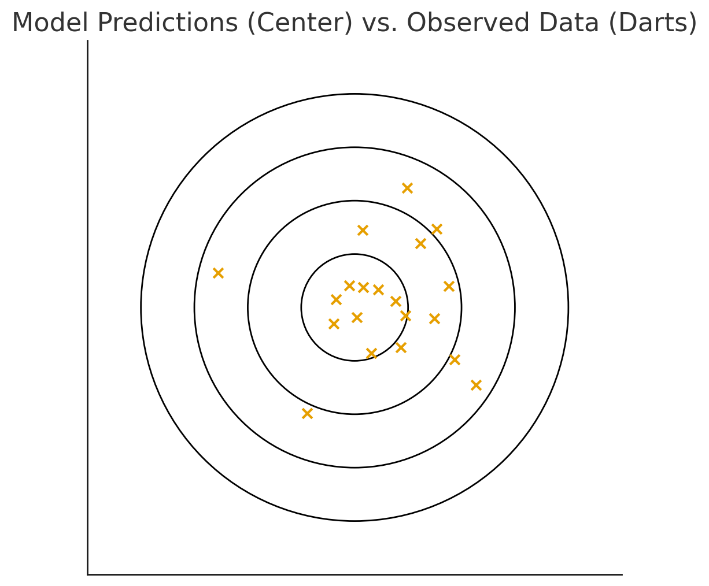

## Objectives

By the end of today you should be able to:

- **Define** the likelihood function and its relationship to statistical infrerence.

- **Recognize** key assumptions of statistical models and how spatial data may challenge those assumptions.

- **Simulate** fake data with known relationships

- **Fit** simple linear and generalized linear models to spatial data

## Inference for First Order Properties

$$
\begin{equation}
z(\mathbf{x}) = \mu(\mathbf{x}) + \epsilon(\mathbf{x})
\end{equation}
$$

* Often we actually care about the "drivers" of $\mu(x)$

* Inference not prediction

* "Which spatial attributes drive $z(\mathbf{x})$ ?"

* Does $\mu(x)$ increase or decrease with changes in a particular variable?"

## Using regression to estimate mu

$$
\begin{equation}
z(\mathbf{s}) \sim Distr(\mu, \sigma)\\
\mu = w_0 + \sum_{i=1}^{m}w_iX_i(\mathbf{s}) + \epsilon
\end{equation}
$$

* When $z(s)$ is binary &rightarrow; logistic regression

* When $z(s)$ is continuous &rightarrow; linear (gamma) regression

* When $z(s)$ is discrete &rightarrow; Poisson regression

* Assumptions about $\epsilon$ matter!!

## Common Regression Forms

::: {style="text-align: left; margin-left: 1em;"}
$$
\begin{aligned}
y &\sim N(\bar{y}, \bar{\sigma}) &&\quad\text{(linear regression)}\\
y &= w_0 + \sum_{i=1}^{m}w_iX_i(\mathbf{s}) + \epsilon\\
\\
y &\sim \text{Bern}(p) &&\quad\text{(logistic regression)}\\
\text{logit}(y) &= w_0 + \sum_{i=1}^{m}w_iX_i(\mathbf{s}) + \epsilon\\
\\
y &\sim \text{Poisson}(\lambda) &&\quad\text{(Poisson regression)}\\
\log(\lambda) &= w_0 + \sum_{i=1}^{m}w_iX_i(\mathbf{s}) + \epsilon
\end{aligned}
$$
:::

## Key components

* **Distributional** assumptions - the likelihood

* $w_i$ is 'spatial weight', equivalent to $\beta$ in typical regression

* _link_ function scales linear model to appropriate support

## Estimating parameters

* You measure $y$

* Your model expresses your hypothesis about the rules governing $y$

* We need estimates of $w_i$ to complete our rule

## Estimating parameters via the Likelihood Function

$$
p(y_i \mid w, \sigma)
= \frac{1}{\sqrt{2\pi\sigma^2}}
\exp\!\left(-\frac{(y_i - w_iX_i(\mathbf{s}))^2}{2\sigma^2}\right)\\
p(\mathbf{y}\mid w, \sigma)
= \prod_{i=1}^n
\frac{1}{\sqrt{2\pi\sigma^2}}
\exp\!\left(-\frac{(y_i - w_iX_i(\mathbf{s}))^2}{2\sigma^2}\right)
$$

## Estimating parameters via the likelihood function

* Maximum Likelihood: treats $w_i$ as fixed, unknown constants. Uncertainty calculated after...

* Bayesian = $w_i$ is a random quantity which varies within the constraints of our _prior_. Uncertainty built into the estimation process.

## 

::: columns
::: {.column width="50%"}

:::
::: {.column width="50%"}
* MLE: "What's the best dart throw?"

* Bayesian: “Given where darts tend to land, what is the distribution of possible aiming points?”

:::
:::

## Deriving model assumptions from the likelihood

* Shape of likelihood function gives an indication of residual behavior

* $\prod$ signals independent observations

* Moments of the distribution add assumptions (i.e. Poisson mean = variance)

# Logistic Regression and Distribution Models {background="#9F281A"}

## Why do we create distribution models?

::: columns
::: {.column width="60%"}
::: {style="font-size: 0.7em"}

* To identify important correlations between predictors and the occurrence of an event

* Generate maps of the 'range' or 'niche' of events

* Understand spatial patterns of event co-occurrence

* Forecast changes in event distributions 

:::
:::
::: {.column width="40%"}
](img/slide_19/climchange.png)
:::
:::

## General analysis situation 

](img/slide_19/SDMfigure1resized.png)

::: {style="font-size: 0.7em"}
* Spatially referenced locations of events $(\mathbf{y})$ sampled from the study extent

* A matrix of predictors $(\mathbf{X})$ that can be assigned to each event based on spatial location

>__Goal__: Estimate the probability of occurrence of events across unsampled regions of the study area based on correlations with predictors

:::

## Modeling Presence-Absence Data

::: columns
::: {.column width="50%"}
* Random or systematic sample of the study region

* The presence (or absence) of the event is recorded for each point

* Hypothesized predictors of occurrence are measured (or extracted) at each point 

::: 
::: {.column width="50%"}
](img/slide_19/Predicting_habitats.png)
:::
:::

## Logistic regression

::: columns
::: {.column width="50%"}

::: {style="font-size: 0.7em"}
* We can model favorability as the __probability__ of occurrence using a logistic regression

* A _link_ function maps the linear predictor $(\mathbf{x_i}'\beta + \alpha)$ onto the support (0-1) for probabilities

* Estimates of $\beta$ can then be used to generate 'wall-to-wall' spatial predictions

:::

:::
::: {.column width="50%"}

$$ 
\begin{equation}
y_{i} \sim \text{Bern}(p_i)\\
\text{link}(p_i) = \mathbf{x_i}'\beta + \alpha
\end{equation}
$$

](img/slide_19/Probit.png)

:::
:::

## Comparison with Machine Learning

* Statistical models describe a generative process: how'd the data get here

* Machine learning models ask something different

* Underlying modes of prediction